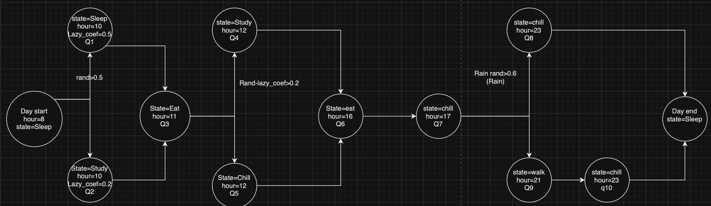
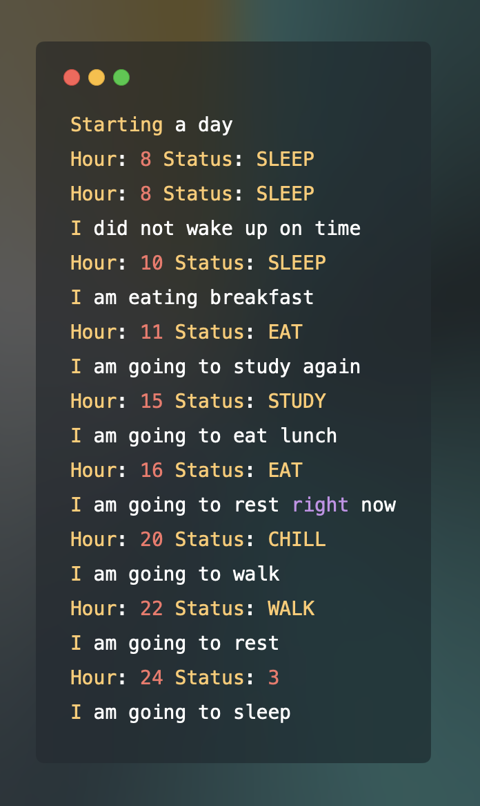
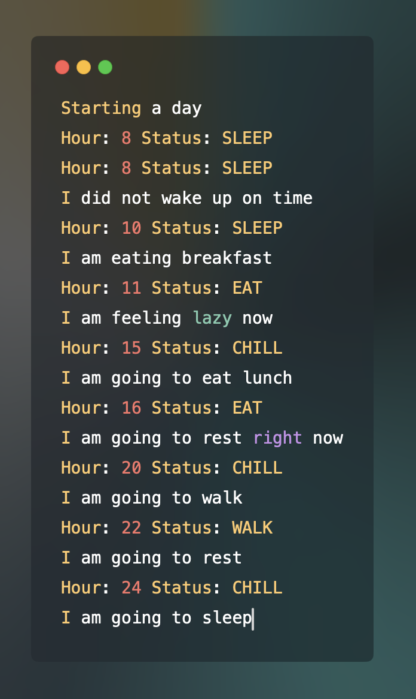
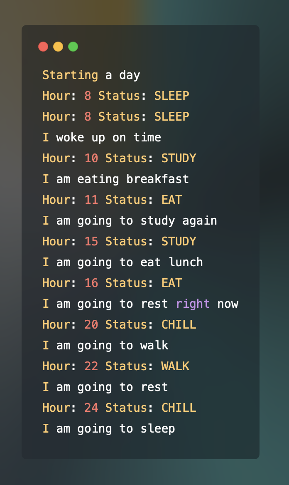
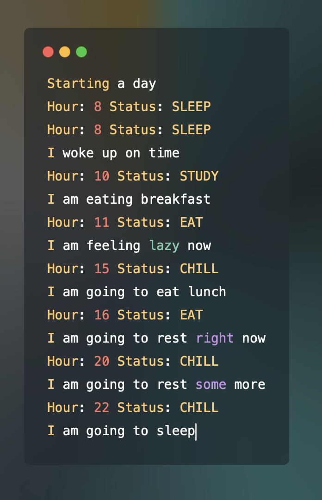

# Lab 4 by Sen Ivan
Finite state machine that represents my daily routine

## State Diagram



## Usage
1. Run the python file:
```zsh
python3 fsm.py
```
2. Or create instance of the class 'Me' and run run_day() method:
```python
from fsm import Me
me = Me()
me.run_day()
```


## Output examples



